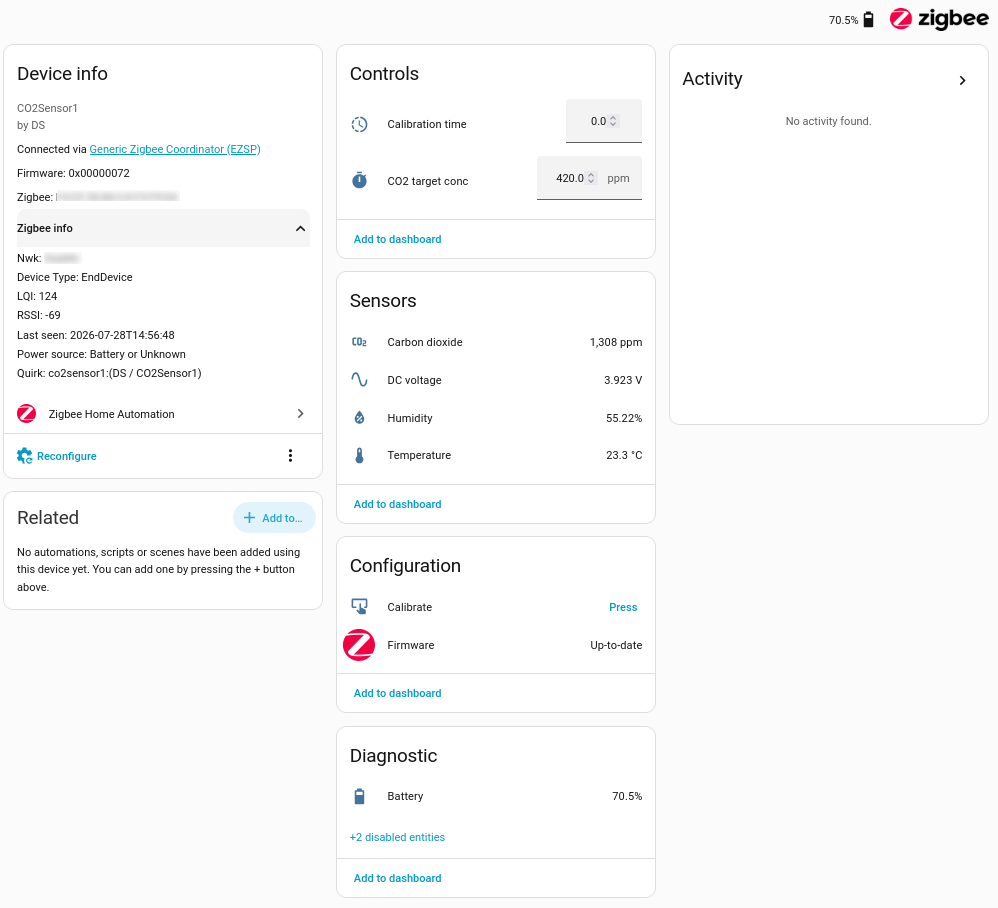

# nrf52-co2-sensor

Zigbee applications for the nRF52840 can be developed using either the older,
bare-metal nRF5 SDK for Thread and Zigbee or the newer, Zephyr-based nRF
Connect SDK. This project uses the nRF5 SDK because it provides a relatively
straightforward bare-metal starting point.

## Firmware

The firmware in this repository implements a CO2 sensor using the popular
Tenstar Pro Micro nRF52840 board and a Sensirion SCD40 sensor. It exposes ten Zigbee clusters across three endpoints:

- CO2 concentration (SCD40)
- Relative humidity (SCD40)
- Temperature (SCD40)
- Power configuration: battery percentage
- Electrical measurement: battery voltage
- Two Analog Output clusters: sensor calibration
- Two Basic clusters: system information
- OTA Upgrade client cluster: remote firmware updates

### Building from source

This firmware is built using the
[nRF5 SDK for Thread and Zigbee 4.2.0](https://www.nordicsemi.com/Products/Development-software/nRF5-SDK-for-Thread-and-Zigbee/Download).
Unlike the standard nRF5 SDK commonly used for Bluetooth projects, this
separate distribution includes the ZBOSS stack and Zigbee components required
by the project. Download and unpack the SDK,
then set `SDK_ROOT` in `firmware/Makefile` to its location. Set
`GNU_INSTALL_ROOT` in `${SDK_ROOT}/components/toolchain/gcc/Makefile.posix` to
the `bin` directory of the installed Arm GNU toolchain.

The `nrfjprog` command-line utility is needed to program and manipulate flash
memory through SWD. Nordic `nrfutil` is used to generate the application DFU
settings, while `adafruit-nrfutil` creates and uploads packages for an
Adafruit nRF52 serial bootloader.

- [`nrfjprog` download page](https://www.nordicsemi.com/Products/Development-tools/nRF-Command-Line-Tools/Download)
- [`nrfutil` download page](https://www.nordicsemi.com/Products/Development-tools/nRF-Util)
- [`adafruit-nrfutil` repository](https://github.com/adafruit/Adafruit_nRF52_nrfutil)

The Makefile defines targets for two types of firmware image: one for direct
programming and one for use with a preinstalled bootloader.

See [build.md](build.md) for details about build targets, firmware formats,
and flashing.

## Hardware

This sensor system is based on the
[nRF52840 battery sensor platform](https://github.com/David-EIPI/battery-sensor-nrf52840).

### Sensor operation

The SCD40 CO2 sensor is reasonably energy-efficient. However, in a
battery-powered design it is better to leave the sensor unpowered when it is
not in use, which is most of the time. Conveniently, the Pro Micro board has
an application-controlled LDO output (pad name `EXT VCC`) that can control the SCD40 power supply.

The SCD40 needs time to warm up after power-on. The datasheet specifies one
second, but I have found experimentally that a longer delay works better. CO2 readings taken immediately after this minimum delay are about 10% lower than the values reported after the sensor has settled. Measurements also stabilize only after a few readings; discarding three or four initial readings appears to be optimal. Interestingly, a delay while powered is not sufficient by itself: the sensor must perform measurements before consecutive readings stabilize.

Long delays and multiple warm-up measurements consume additional battery
power. While active, the SCD40 performs measurements periodically.
By default, the firmware discards the first measurement and reports the next
one. This behavior can be changed by editing the `NUM_DISCARD` and
`NUM_AVERAGE` macros in `sensor.c` and rebuilding the firmware.

The datasheet specifies an average current of 100–200 mA over the complete
measurement interval. Each measurement includes short current bursts lasting
approximately 12 ms. Based on the observed voltage drop across the board's
LDO and the regulator's datasheet curves, I estimate that the current reaches approximately 500 mA during these bursts. Together with standby current, this duty cycle results in an average system current of approximately 0.5–1.0 mA when a measurement series runs once every five minutes.

The base PCB can hold up to three 18650 cells. With commonly available 3.5 Ah cells providing a total capacity of 10.5 Ah, the sensor should be able to run for more than a year between charges.

The firmware stops reading the sensor when the battery voltage drops to or
below 3.4 V. This threshold is determined by the voltage drop across the VCC
regulator. At the estimated burst current, the voltage drop across the LDO is approximately 150–200 mV. The SCD40 measurement output depends on its supply voltage; when the LDO can no longer maintain a steady 3.3 V, readings
gradually decrease with the supply voltage. The 3.4 V cutoff is conservative, with approximately 85–90% of the battery capacity already used.

Most 18650 Li-ion cells are not intended for prolonged low-current
applications and have a fairly high self-discharge rate. However, they are
inexpensive and have high capacity, so charging the sensor once a year is an
acceptable chore for me.

### Sensor calibration

Periodic calibration helps the SCD40 maintain accurate measurements. This
firmware disables automatic self-calibration and allows forced calibration to
be triggered through Zigbee. First, place the sensor in a location with a
known CO2 concentration. The SCD40 datasheet recommends fresh outdoor air as
a reference; its background concentration is currently approximately
430 ppm. Set the value of the Analog Output cluster on endpoint 2 to this
target concentration. Then set the value of the Analog Output cluster on
endpoint 1 to the calibration duration in seconds; the datasheet specifies at least 180 seconds.

The [included ZHA quirk](quirk/co2sensor1.py) exposes calibration as a Home
Assistant button that starts a 250-second calibration. During calibration, the calibration duration value counts down to zero. When it reaches zero, the calibration correction is stored in the sensor's nonvolatile memory.

## Home Assistant

The ZHA quirk adds a convenient calibration button and a numeric entity that
shows the remaining calibration time. It configures a 10-second minimum
reporting interval for that value.

The resulting Home Assistant device page looks like this:

